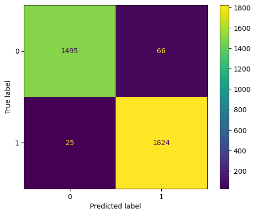
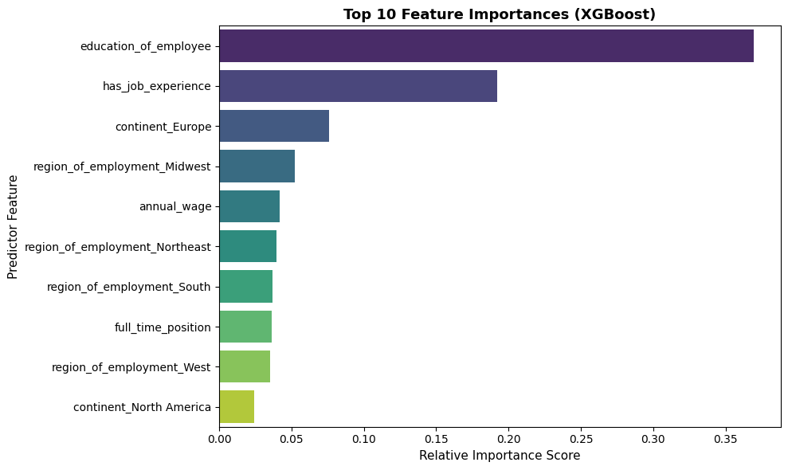

# US Visa Approval Prediction — End-to-End ML & MLOps System

> Predicts whether a US visa application is likely to be **Certified** or **Denied**, using a full MLOps pipeline: data validation, model training/evaluation, AWS model storage, and CI/CD deployment.


## 📌 Problem

Given an applicant's education, employment history, wage, and employer details, can we predict whether their visa application will be Certified or Denied? This matters because manual case-by-case evaluation doesn't scale, and inconsistent decisions cost applicants and employers time and money.

- **Dataset:** [EasyVisa (Kaggle)](https://www.kaggle.com/datasets/moro23/easyvisa-dataset) — 25,480 rows, 12 features
- **Task:** Binary classification (Certified / Denied)
- **Class balance:** 66.8% Certified / 33.2% Denied — accuracy alone is misleading here, so F1/precision/recall drove model selection

---


## 🏗️ Architecture & Engineering Deep Dive

### 1. Full Pipeline Architecture

```text
                    ┌─────────────────────┐
                    │   MongoDB Atlas     │
                    │   Raw Visa Data     │
                    └──────────┬──────────┘
                               │
                               ▼
                    ┌─────────────────────┐
                    │   Data Ingestion    │
                    └──────────┬──────────┘
                               │
                               ▼
                    ┌─────────────────────┐
                    │   Data Validation   │
                    │      Evidently      │
                    └──────────┬──────────┘
                               │
                               ▼
                    ┌─────────────────────┐
                    │ Data Transformation │
                    │ Encoding + Scaling  │
                    │ Feature Engineering │
                    └──────────┬──────────┘
                               │
                               ▼
                    ┌─────────────────────┐
                    │   Model Training    │
                    │   GridSearchCV      │
                    └──────────┬──────────┘
                               │
                               ▼
                    ┌─────────────────────┐
                    │  Model Evaluation   │
                    └──────────┬──────────┘
                               │
                    ┌──────────┴──────────┐
                    │                     │
                 Rejected              Accepted
                    │                     │
                    ▼                     ▼
                  Stop              Model Pusher
                                          │
                                          ▼
                                  ┌──────────────┐
                                  │   AWS S3     │
                                  │Model Registry│
                                  └──────┬───────┘
                                         │
                                         ▼
                                  CI/CD Pipeline
                                         │
                                         ▼
                                    Deployment
```

**Stage responsibilities:**

| Stage | Responsibility |
|---|---|
| Data Ingestion | Pulls raw records from MongoDB Atlas into a working dataset |
| Data Validation | Uses Evidently to check schema, detect drift, and flag data quality issues before training |
| Data Transformation | Encodes categorical features (one-hot / ordinal), scales numerical features (PowerTransformer + StandardScaler, Yeo-Johnson for skewed features), engineers `company_age` from `yr_of_estab` |
| Model Training | Trains multiple candidate models with `GridSearchCV` for hyperparameter tuning |
| Model Evaluation | Compares candidates against the current production model; only promotes a challenger if it outperforms it |
| Model Pusher | Pushes the accepted model artifact to AWS S3 |
| CI/CD | Automates build, test, and deployment on every push |

---


## 🤖 Models & Results

Nine classification algorithms were trained and compared on the test set using Accuracy, F1, Precision, Recall, and ROC-AUC — not accuracy alone, given the ~2:1 class imbalance.

| Model                     | Accuracy | F1-Score | Precision | Recall | ROC-AUC |
|---------------------------|---------:|---------:|----------:|-------:|--------:|
| **Random Forest**         | **0.9534** | **0.9572** | 0.9538 | **0.9605** | **0.9527** |
| XGBoost                   | 0.9352   | 0.9400   | **0.9443** | 0.9356 | 0.9351 |
| K-Neighbors Classifier    | 0.9402   | 0.9457   | 0.9318   | 0.9600 | 0.9383 |
| Decision Tree             | 0.9299   | 0.9356   | 0.9328   | 0.9383 | 0.9291 |
| CatBoosting Classifier    | 0.9296   | 0.9342   | 0.9472   | 0.9216 | 0.9304 |
| Gradient Boosting         | 0.8956   | 0.9031   | 0.9095   | 0.8967 | 0.8955 |
| Support Vector Classifier | 0.8701   | 0.8802   | 0.8800   | 0.8805 | 0.8691 |
| AdaBoost Classifier       | 0.8683   | 0.8774   | 0.8863   | 0.8686 | 0.8683 |
| Logistic Regression       | 0.7449   | 0.7590   | 0.7780   | 0.7409 | 0.7452 |

**Selected model: Random Forest** — best or near-best on every test metric, including recall on the minority (Denied) class, which matters more here than raw accuracy given the class imbalance.

<p align="center">
  
  
</p>

---

## 💡 Key Insight

Because ~2/3 of applications are Certified, a model can look strong on accuracy while quietly failing on Denied cases — the class that actually matters most for catching risky approvals. This pushed the evaluation strategy toward F1-score and per-class recall rather than accuracy alone. The harder engineering problem also wasn't the model itself — it was building a pipeline where preprocessing stays consistent between training and inference and no data leakage sneaks in through resampling (SMOTEENN is applied only to training data, never to the test set).

---

## 🧩 Tech Stack

`Python` · `Scikit-learn` · `Pandas / NumPy` · `imbalanced-learn (SMOTEENN)` · `MongoDB Atlas` · `Evidently` · `AWS S3 / Boto3` · `FastAPI` · `Docker` · `GitHub Actions`

---


## 📁 Project Structure

The repository follows a modular pipeline structure rather than a single notebook.

```text
end-to-end-us-visa-approval-prediction/
│
├── .github/
│   └── workflows/
│       └── cicd.yaml
│
├── config/
│   └── model.yaml
│
├── notebook/
│   ├── mongodb_connection/
│   │   └── 1_Storing_data_MongoDB.ipynb
│   │
│   ├── eda/
│   │   ├── 2_EDA_US_visa.ipynb
│   │   └── mongodb_flow_diagram.excalidraw
│   │
│   └── feature_engineering/
│       ├── 3.1_Feature_Engineering_and_Model_Training.ipynb
│       └── 3.2_Feature_Engineering_and_Model_Training.ipynb
│
├── us_visa/
│   ├── components/
│   │   ├── data_ingestion.py
│   │   ├── data_validation.py
│   │   ├── data_transformation.py
│   │   ├── model_trainer.py
│   │   ├── model_evaluation.py
│   │   └── model_pusher.py
│   │
│   ├── configuration/
│   │   ├── __init__.py
│   │   ├── aws_connection.py
│   │   ├── mongo_db_connection.py
│   │   └── model_pusher.py
│   │
│   ├── cloud_storage/
│   │   └── aws_storage.py
│   │
│   ├── data_access/
│   │   ├── __init__.py
│   │   └── usvisa_data.py
│   │
│   ├── entity/
│   │   ├── config_entity.py
│   │   └── artifact_entity.py
│   │
│   ├── pipeline/
│   │   ├── training_pipeline.py
│   │   └── prediction_pipeline.py
│   │
│   ├── constants/
│   │   └── __init__.py
│   │
│   └── utils/
│       └── main_utils.py
│
├── artifacts/
│   └── <timestamp>/          # e.g. 08_27_2026_21_40_01/ — data ingestion, validation & training artifacts
│
├── assets/
│   ├── confusion_matrix.png
│   ├── roc_curve.png
│   └── feature_importance.png
│
├── app.py
├── demo.py
├── Dockerfile
├── requirements.txt
├── .gitignore
└── README.md
```


## ▶️ Quick Start

```bash
git clone https://github.com/KzRaihan/end-to-end-us-visa-approval-prediction.git
```

```bash
conda create -n visa python=3.8 -y
```

```bash
conda activate visa
```

```bash
pip install -r requirements.txt
```
### Add MongoDB/AWS credentials as environment variables (see .env.example)
```bash
python demo.py
```

---

## ⚠️ Limitations & Next Steps

- Trained on 25,480 records — a larger, more diverse dataset would improve generalization
- Model reflects patterns in *historical* visa decisions, which may carry historical bias
- Only classical ML models evaluated so far — gradient boosting (XGBoost/LightGBM) is a planned comparison
- No production monitoring yet for data drift or prediction distribution over time


---


## 📚 What I Learned

Building this project shifted my understanding of what "building a model" actually means in practice:

- **Data quality** has a direct, measurable effect on model reliability — not just a preprocessing checkbox.
- **Class imbalance** makes accuracy alone misleading; F1/precision/recall tell the real story.
- **Feature engineering** needs a stated reason (`company_age` vs. raw `yr_of_estab`), not transformation for its own sake.
-  **Training/inference consistency** — using different preprocessing between the two silently breaks a model in production.
- **No leakage** — resampling (SMOTEENN) belongs only on training data; touching the test set invalidates evaluation.
- **Deliberate model gating** — a new model should only replace production if it actually outperforms it, not by assumption.
-  **MLOps mindset** — this is what turns a one-off experiment into a system someone else (or future-you) can actually run, trust, and maintain.

---
## 👨‍💻 Author

**Md Kamruzzaman** — MACHINE LEARNING ENGINEER 
[GitHub](https://github.com/KzRaihan) · [LinkedIn](https://www.linkedin.com/in/kzraihan/)

---
